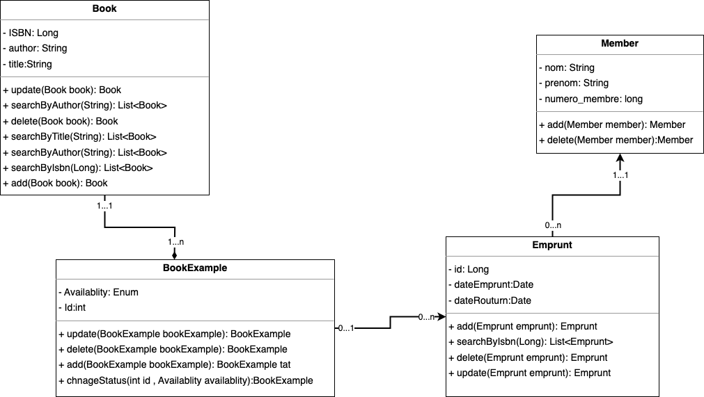
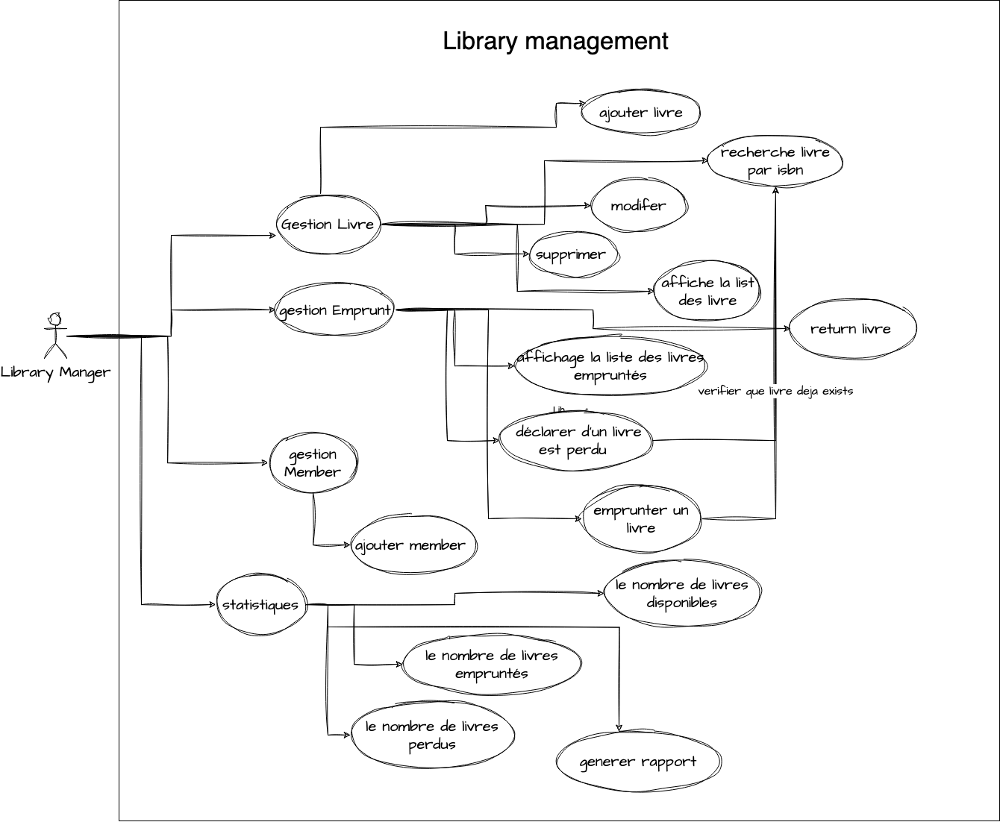

# Application Gestion Bibliotheque

### Installation de l'application

- Cloner le projet sur votre machine locale
- Ouvrir le projet dans votre IDE
- run commande `mvn clean install` pour installer les dépendances
- run commande docker `docker-compose up` pour lancer la base de données
- exécuter le script `./database.sql` pour créer la base de données
- run commande `mvn spring-boot:run` pour lancer l'application
- L'application est accessible sur console

### Prérequis
- Java 17 and +
- Maven 3.6.3
- DOCKER
- git 2.25.1
- IDE (IntelliJ IDEA, Eclipse, NetBeans, etc.)

## DIAGRAMME DE CLASSES

## DIAGRAMME DE SEQUENCE

## PROJECT CONTEXT
Contexte La bibliothèque municipale de la ville de paris rencontre plusieurs problèmes liés à la gestion manuelle des livres et à l'absence d'un système de suivi efficace. Ces problèmes se traduisent particulièrement par les difficultés suivantes:

-Gestion inefficace : Les bibliothécaires doivent effectuer toutes les tâches liées à la gestion des livres manuellement, ce qui peut entraîner des erreurs et une perte de temps. Il est difficile de maintenir une base de données à jour et de suivre l'état de chaque livre (disponible ou emprunté).

-Difficultés de recherche : Les utilisateurs de la bibliothèque ont du mal à trouver les livres qu'ils souhaitent emprunter. L'absence d'un système de recherche efficace rend la recherche fastidieuse et peut décourager les utilisateurs.

-Manque de statistiques : Il n'existe aucun moyen facile d'obtenir des statistiques sur les livres disponibles, les livres empruntés et les livres perdus. Cela limite la capacité de la bibliothèque à analyser et à optimiser ses collections.

En résumé, le besoin est de développer une application console de gestion des bibliothèques en Java, qui permettra une gestion automatisée des livres, une recherche efficace, une gestion des emprunts et des retours, ainsi que la génération de rapports statistiques. Cette application vise à résoudre les problèmes de gestion inefficace et de difficulté de recherche rencontrés par la bibliothèque, tout en améliorant l'expérience des utilisateurs.

Besoin Pour résoudre les problèmes mentionnés, la bibliothèque a besoin d'une application console de gestion des bibliothèques offrant les fonctionnalités suivantes :

-Gestion automatisée des livres : L'application doit permettre aux bibliothécaires de gérer les livres de manière automatisée, en leur permettant d'ajouter de nouveaux livres, de mettre à jour les informations sur les livres existants et de supprimer des livres de la base de données.

-Système de recherche efficace : L'application doit offrir aux utilisateurs un moyen rapide et efficace de rechercher des livres par titre ou auteur. Cela facilitera la découverte des livres disponibles dans la bibliothèque.

-Gestion des emprunts et des retours : L'application doit permettre aux bibliothécaires d'enregistrer les emprunts et les retours de livres. Elle devrait également maintenir un suivi de l'état de chaque livre (disponible ou emprunté).

-Génération de rapports statistiques : L'application doit générer des rapports statistiques sur les livres disponibles, les livres empruntés et les livres perdus. Cela permettra à la bibliothèque d'analyser les tendances et de prendre des décisions éclairées pour optimiser sa collection de livres.

Histoires utilisateurs

---En tant qu'utilisateur, je veux pouvoir ajouter un nouveau livre à la bibliothèque en fournissant son titre, son auteur et son numéro ISBN, afin de garder une trace des livres disponibles. Définition terminée : L'utilisateur peut saisir les informations du livre (titre, auteur, numéro ISBN) via l'interface de l'application console. L'application valide les données saisies, ajoute le livre à la base de données de la bibliothèque avec un statut initial "disponible" et affiche un message de confirmation à l'utilisateur.

---En tant qu'utilisateur, je veux pouvoir afficher la liste complète des livres disponibles dans la bibliothèque, y compris leur titre, leur auteur et leur statut (disponible ou emprunté). Définition terminée : L'utilisateur peut sélectionner l'option d'affichage de la liste des livres disponibles dans l'application console. L'application interroge la base de données pour récupérer tous les livres avec le statut "disponible" et affiche les informations (titre, auteur, statut) de chaque livre à l'écran.

---En tant qu'utilisateur, je veux pouvoir rechercher un livre par son titre ou son auteur, afin de trouver rapidement les livres qui m'intéressent. Définition terminée : L'utilisateur peut saisir un titre ou un auteur dans l'application console pour effectuer une recherche. L'application interroge la base de données pour trouver les livres correspondants aux critères de recherche et affiche les résultats à l'écran.

---En tant qu'utilisateur, je veux pouvoir emprunter un livre en fournissant son numéro ISBN, afin de mettre à jour son statut dans la bibliothèque. Définition terminée : L'utilisateur peut saisir le numéro ISBN d'un livre disponible pour l'emprunter via l'application console. L'application vérifie si le livre est disponible, met à jour son statut en "emprunté" dans la base de données, enregistre les informations de l'emprunteur (nom, numéro de membre, etc.) et la date d'emprunt, puis affiche un message de confirmation à l'utilisateur.

---En tant qu'utilisateur, je veux pouvoir retourner un livre emprunté en fournissant son numéro ISBN, afin de mettre à jour son statut dans la bibliothèque. Définition terminée : L'utilisateur peut saisir le numéro ISBN d'un livre emprunté pour le retourner via l'application console. L'application vérifie si le livre est effectivement emprunté, met à jour son statut en "disponible" dans la base de données, supprime les informations d'emprunteur et de date d'emprunt, puis affiche un message de confirmation à l'utilisateur.

---En tant qu'utilisateur, je veux pouvoir afficher la liste des livres empruntés, y compris les informations sur les emprunteurs et la date d'emprunt, afin de suivre les emprunts en cours. Définition terminée : L'utilisateur peut sélectionner l'option d'affichage de la liste des livres empruntés dans l'application console. L'application interroge la base de données pour récupérer tous les livres avec le statut "emprunté", affiche les informations (titre, auteur, informations de l'emprunteur, date d'emprunt) de chaque livre à l'écran.

---En tant qu'utilisateur, je veux pouvoir supprimer un livre de la bibliothèque en fournissant son numéro ISBN, afin de retirer les livres obsolètes ou perdus de la collection. Définition terminée : L'utilisateur peut saisir le numéro ISBN d'un livre pour le supprimer de la base de données de la bibliothèque via l'application console. L'application vérifie si le livre existe dans la base de données, le supprime de la collection et affiche un message de confirmation à l'utilisateur.

---En tant qu'utilisateur, je veux pouvoir modifier les informations d'un livre existant (titre, auteur, etc.) en fournissant son numéro ISBN, afin de mettre à jour les détails si nécessaire. Définition terminée : L'utilisateur peut saisir le numéro ISBN d'un livre pour accéder à ses informations via l'application console. L'application affiche les informations actuelles du livre et permet à l'utilisateur de modifier les champs pertinents (titre, auteur, etc.). Une fois les modifications effectuées, l'application met à jour les informations du livre dans la base de données et affiche un message de confirmation à l'utilisateur.

---En tant qu'utilisateur, je veux pouvoir générer un rapport contenant les statistiques sur les livres disponibles, les livres empruntés et les livres perdus, afin de suivre l'état de la bibliothèque. Définition terminée : L'utilisateur peut sélectionner l'option de génération de rapport dans l'application console. L'application analyse la base de données, génère un rapport détaillé contenant des statistiques sur les livres disponibles, les livres empruntés et les livres perdus, et affiche le rapport à l'écran ou l'enregistre dans un fichier. Le rapport inclut des informations telles que le nombre total de livres, le nombre de livres disponibles, le nombre de livres empruntés, le nombre de livres perdus, etc.

